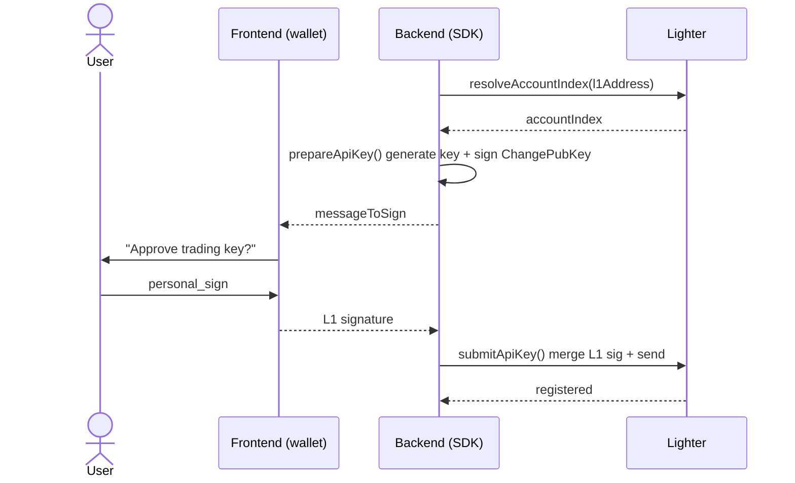
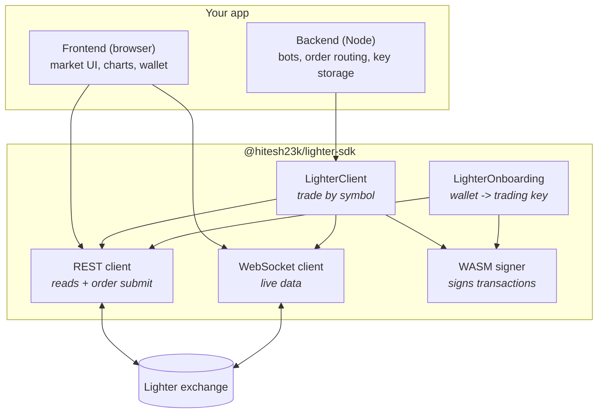

# Lighter Perpetual Futures SDK for TypeScript & JavaScript

[](https://www.npmjs.com/package/@hitesh23k/lighter-sdk)
[](https://www.npmjs.com/package/@hitesh23k/lighter-sdk)
[](https://www.npmjs.com/package/@hitesh23k/lighter-sdk)
[](./LICENSE)
[](#why-this-sdk)

The unofficial **TypeScript / JavaScript SDK for [Lighter](https://lighter.xyz)** — trade perpetual
futures, place orders with take-profit and stop-loss, stream real-time market data over WebSocket, onboard
wallets, and sign transactions, from **Node.js or the browser**. Supports **both venues: zkLighter (`zk`)
and Robinhood-Chain Lighter (`robinhood`)**, on mainnet and testnet.

```bash
npm install @hitesh23k/lighter-sdk
```

## What is Lighter?

[Lighter](https://lighter.xyz) is a high-performance, order-book **perpetual futures exchange** (a
decentralized derivatives DEX) built as a **zk-rollup** on Ethereum. Trades are matched on a real order
book and settled with zero-knowledge proofs, giving centralized-exchange speed with on-chain
verifiability. It runs across a few deployments that share the same core: **zkLighter** and the
**Robinhood-Chain** instance, on mainnet and testnet.

## What is this SDK?

`@hitesh23k/lighter-sdk` is a batteries-included client for the Lighter API. It handles the hard part —
Lighter's zk transaction signing has no native JavaScript implementation, so this SDK ships the official
signer compiled to WebAssembly and loads it in-process. You get a clean, typed API for everything:

- 📈 **Trade perpetuals** — market, limit, and **bracket orders** (entry + take-profit + stop-loss in one atomic transaction)
- 📊 **Read market data** — order books, prices, funding rates, candles, positions, balances
- ⚡ **Real-time streaming** — WebSocket order book, trades, and authenticated account updates
- 🔑 **Onboarding** — link a wallet to a trading key in one flow (nobody else has this)
- 🔀 **Both venues** — zkLighter (`zk`) and Robinhood-Chain Lighter (`robinhood`), mainnet and testnet, one API
- 🛡️ **Built-in safety** — automatic nonce sequencing, market-order price bounds, minimum-size checks
- 🌐 **Runs everywhere** — Node.js and the browser, ESM and CommonJS, fully typed
- 🪶 **Zero runtime dependencies** — ~50 KB browser bundle, no `ethers`/`axios` bloat

## Why this SDK

- **Human units, not hand-scaled integers.** Say `size: 0.5` and `price: 3050.5`; the SDK scales to the
  exchange's fixed-point encoding for you. Use `side: "long" | "short"`, not raw `isAsk` booleans.
- **Zero dependencies.** No `ethers`, no `axios`. A tiny footprint, a clean supply chain, and a browser
  bundle around 50 KB.
- **Safe by default.** Concurrent orders never race to a duplicate nonce, market orders always carry a
  worst-case price bound, and sub-minimum orders are caught before they cost you a transaction.
- **Verified on testnet** end to end, across both venues.

## Contents

- [Installation](#installation)
- [Quick start](#quick-start)
- [Reading market data](#reading-market-data)
- [Placing orders](#placing-orders)
- [Positions, leverage, and margin](#positions-leverage-and-margin)
- [Real-time WebSocket data](#real-time-websocket-data)
- [Onboarding: get a trading key](#onboarding-get-a-trading-key)
- [Withdrawals](#withdrawals)
- [Error handling](#error-handling)
- [Using in the browser](#using-in-the-browser)
- [Networks and venues](#networks-and-venues)
- [How it works](#how-it-works)
- [API overview](#api-overview)
- [Limitations](#limitations)
- [License](#license)

## Installation

```bash
npm install @hitesh23k/lighter-sdk
# or: pnpm add @hitesh23k/lighter-sdk / yarn add @hitesh23k/lighter-sdk
```

Requires **Node.js 18+** (uses global `fetch` and WebAssembly). Types are bundled — no `@types` package
needed.

> **TypeScript on `nodenext`?** Install `@types/node` and add `"types": ["node"]` to your `tsconfig.json`
> so Node globals resolve. The SDK's own types work out of the box.

## Quick start

`LighterClient` is the high-level, "just trade" entry point. It resolves markets by symbol and converts
human sizes and prices to Lighter's integer encoding automatically.

```ts
import { LighterClient } from "@hitesh23k/lighter-sdk";

const client = new LighterClient({
  venue: "zk",           // "zk" (zkLighter) or "robinhood"
  isMainnet: true,
  signer: { apiPrivateKey: "0x…", accountIndex: 7, apiKeyIndex: 4 },
});

await client.loadMarkets();

// Trade in human units
await client.setLeverage({ symbol: "BTC", leverage: 20 });
await client.placeMarketOrder({ symbol: "BTC", side: "long", size: 0.5 });
await client.placeLimitOrder({ symbol: "ETH", side: "short", size: 2, price: 3050.5 });

// Read your account
const positions = await client.getPositions();

// Stream live data
await client.connect();
client.streamOrderBook("BTC", (msg) => console.log(msg));
```

Don't have a trading key yet? See [Onboarding](#onboarding-get-a-trading-key). Just want market data?
Skip the `signer` and use the read and stream methods.

## Reading market data

No authentication needed for public data.

```ts
const markets = await client.markets();                 // all tradeable markets
const btc = client.market("BTC");                       // symbol -> market metadata

const funding = await client.rest.getFundingRates();    // Lighter funding rates
const trades = await client.rest.getRecentTrades(btc.marketId, 50);
const candles = await client.rest.getCandles({
  market_id: btc.marketId, resolution: "1h",
  start_timestamp: Date.now() - 24 * 3600_000, end_timestamp: Date.now(), count_back: 24,
});
const account = await client.rest.getAccount(7);
```

## Placing orders

```ts
// Market order (a worst-case price bound is added automatically for slippage protection)
await client.placeMarketOrder({ symbol: "BTC", side: "long", size: 0.01, slippage: 0.01 });

// Limit order
await client.placeLimitOrder({ symbol: "BTC", side: "short", size: 0.01, price: 70000, timeInForce: "gtc" });

// Bracket order: entry + take-profit + stop-loss, ONE atomic transaction
await client.placeBracketOrder({
  symbol: "BTC", side: "long", size: 0.01,
  takeProfit: 72000,   // trigger prices in human quote units
  stopLoss: 60000,
});

// Cancel
await client.cancelOrder("BTC", orderIndex);
await client.cancelAllOrders();               // atomic, all markets
```

## Positions, leverage, and margin

```ts
await client.setLeverage({ symbol: "BTC", leverage: 10 });
await client.adjustMargin({ symbol: "BTC", amount: 25, action: "add" });  // isolated margin, human USDC

await client.closePosition("BTC");            // market-close, reduce-only
await client.closeAllPositions();             // flatten everything

// Wait for a transaction to settle
const tx = await client.placeMarketOrder({ symbol: "BTC", side: "long", size: 0.001 });
await client.waitForTransaction(tx.tx_hash!);
```

## Real-time WebSocket data

Reconnect with backoff, re-subscription, and keepalive are all automatic.

```ts
await client.connect();

client.streamOrderBook("BTC", (msg) => { /* live order book */ });
client.streamTrades("BTC", (msg) => { /* live trades */ });
client.streamAccount((msg) => { /* your balances, positions, orders */ });

// later
client.close();
```

Account channels are authenticated; `LighterClient` mints the auth token from your signer automatically.
For lower-level control use `client.ws` (a `LighterWs` instance) or construct one directly.

## Onboarding: get a trading key

To trade you need a **signer**: `{ apiPrivateKey, accountIndex, apiKeyIndex }`. Getting one is a one-time
setup per wallet:

1. **Create an account** by depositing to Lighter via its L1 bridge (on-chain; done with your wallet, not this SDK).
2. **Associate an API key.** The SDK generates a key, signs a `ChangePubKey`, your wallet approves it with one `personal_sign`, and it is submitted. This is a small frontend to backend handshake:



`LighterOnboarding` runs the whole flow. If your wallet lives on the same side as the SDK, one call does it all:

```ts
import { LighterOnboarding, LighterClient } from "@hitesh23k/lighter-sdk";
// bring your own EVM wallet (ethers/viem/etc.) — only used to personal_sign one message

const onboarding = new LighterOnboarding({ venue: "zk", isMainnet: true });

const { signer, apiPrivateKey } = await onboarding.registerApiKey({
  l1Address: wallet.address,
  l1Sign: (message) => wallet.signMessage(message),
});
// Store apiPrivateKey securely — it is your trading credential and cannot be recovered.

const client = new LighterClient({ venue: "zk", isMainnet: true, signer });
```

Splitting signing across a frontend and backend? Use the two-step form: `prepareApiKey()` returns a
`messageToSign` (have the wallet sign it wherever it lives), then `submitApiKey(pending, l1Signature)`.

## Withdrawals

```ts
await client.withdraw({ amount: 100 });   // withdraw 100 USDC to your L1 wallet
```

## Error handling

Errors are thrown (not returned as tuples) and typed, so you can branch on the failure kind:

```ts
import { LighterApiError, LighterSignerError, LighterValidationError } from "@hitesh23k/lighter-sdk";

try {
  await client.placeLimitOrder({ symbol: "BTC", side: "long", size: 0.00001, price: 60000 });
} catch (err) {
  if (err instanceof LighterValidationError) { /* e.g. below minimum size */ }
  else if (err instanceof LighterApiError) { console.log(err.code, err.status); }
  else if (err instanceof LighterSignerError) { /* signing failed */ }
}
```

All SDK errors extend `LighterError`.

## Using in the browser

Import from the `/browser` entry. REST and WebSocket work unchanged (global `fetch` / `WebSocket`). The
only difference is the signer: browsers have no filesystem, so you point it at the WASM assets once at
startup. Both `lighterSigner.wasm` and `wasm_exec.js` ship in the package.

```ts
import { initLighterSigner, LighterClient } from "@hitesh23k/lighter-sdk/browser";
import wasmUrl from "@hitesh23k/lighter-sdk/lighterSigner.wasm?url";        // Vite asset URL
import wasmExecUrl from "@hitesh23k/lighter-sdk/wasm_exec.js?url";

initLighterSigner({ wasmUrl, wasmExecUrl });   // lazy: the WASM loads on the first signing call

const client = new LighterClient({ venue: "zk", isMainnet: true });
```

The browser bundle imports no Node built-ins, so it bundles cleanly with Vite, webpack, and friends.

## Networks and venues

The SDK supports both Lighter deployments. Pick one with the `venue` option; everything else (the same
`LighterClient` API, orders, streams, onboarding) works identically.

| `venue` | Collateral | Networks | Description |
|---|---|---|---|
| `"zk"` (default) | USDC | mainnet, testnet | zkLighter, the main deployment |
| `"robinhood"` | USDG | mainnet, testnet | Robinhood-Chain Lighter |

```ts
const zk = new LighterClient({ venue: "zk", isMainnet: true });          // zkLighter mainnet
const rh = new LighterClient({ venue: "robinhood", isMainnet: true });   // Robinhood-Chain mainnet
const test = new LighterClient({ venue: "zk", isMainnet: false });       // zkLighter testnet
```

`isMainnet: false` selects testnet. The SDK resolves the correct host and signing chain id per venue and
network for you. Accounts and API keys are per-venue (an account on `zk` is unrelated to one on `robinhood`).

## How it works

Five composable building blocks. Your app uses the high-level `LighterClient`, or the low-level pieces directly.



## API overview

| Export | What it does |
|---|---|
| `LighterClient` | High-level, venue-aware client. Trade by symbol in human units; the recommended entry point. |
| `LighterRestClient` | Typed REST client: market data, account reads, and the signed write path. |
| `LighterWs` | WebSocket client: order book, trades, and authenticated account streams. |
| `LighterOnboarding` | Link a wallet to a programmatic trading key (`ChangePubKey` flow). |
| `LighterConstant`, `LighterHelper` | Protocol constants and fixed-point scaling helpers. |
| `sign*` functions | Low-level signers (`signCreateOrder`, `signCreateGroupedOrders`, `signWithdraw`, …). |
| `LighterError` and subclasses | Typed error hierarchy. |

Everything is fully typed. Low-level access is always available via `client.rest` and `client.ws`.

## Limitations

- **Signing** ships a WebAssembly binary and runs in Node (filesystem) or the browser (`initLighterSigner`).
  It does not run on edge runtimes that forbid `fs` and cap bundle size (Cloudflare Workers, Vercel Edge);
  reads and WebSocket work anywhere.
- **Account creation** is an on-chain L1 bridge deposit done with your wallet, not by this SDK. Onboarding
  assumes the account already exists.
- **Account-to-account transfers** additionally require the account owner's L1 signature. The low-level
  `client.rest.transfer` signs the L2 part; the L1 signature is your responsibility. Withdrawals do not
  need this.

## License

[Apache-2.0](./LICENSE). Bundled third-party components (the Lighter Go signer and Go's WASM runtime glue)
are attributed in [NOTICE](./NOTICE).

---

Not affiliated with or endorsed by Lighter or Elliot. "Lighter" and "zkLighter" are used to describe API
compatibility. Trading perpetual futures involves risk; use at your own risk.
