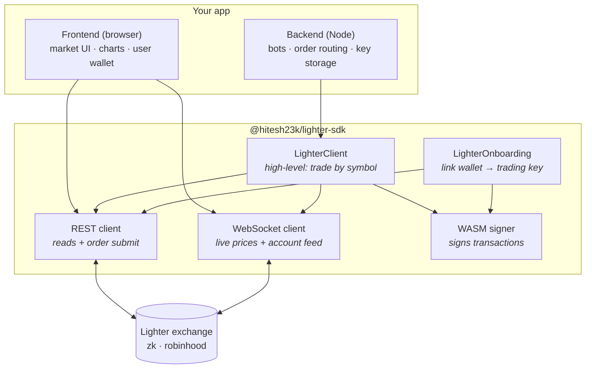
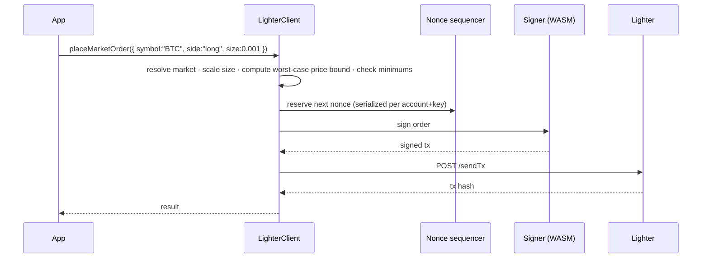
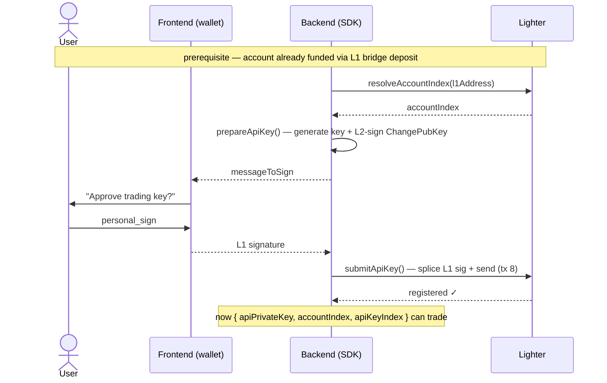

# @hitesh23k/lighter-sdk

TypeScript/JavaScript SDK for **Lighter (zkLighter)** and the **Robinhood-Chain Lighter** deployment.

Lighter's transactions are signed with a ZK-rollup scheme (Poseidon hash over the Goldilocks field,
Schnorr-style) that has no native JavaScript implementation. This SDK ships elliottech's official Go
signer compiled to WebAssembly and loads it in-process, so signing works on any OS from one artifact —
no per-platform native binaries.

Includes a WASM-backed zk signer, a typed REST client, a WebSocket streaming client, a high-level
venue-aware convenience client, bracket orders, onboarding, and a browser build.

**Why this one:** zero runtime dependencies (no ethers/axios), a ~50 KB browser bundle, and a human-unit
API — trade by symbol (`buy 0.5 BTC`), not by hand-scaled integers. Nonce-safe under concurrency,
market-order price bounds, and onboarding built in. Verified end to end on testnet across both venues.

## How it fits together

The SDK is five building blocks. Your app talks to the high-level `LighterClient` (or the low-level
pieces directly); the client handles the REST, WebSocket, and signing layers for you.



| Block | What it does |
|---|---|
| **`LighterClient`** | The easy button. Trade by symbol ("buy 0.001 BTC"); it scales sizes/prices, maps `long`/`short`, and composes the layers below. |
| **REST client** | Read data (markets, prices, funding, account, positions) and submit signed orders over HTTP. |
| **WebSocket client** | Live feed: order book, trades, and your authenticated account updates. |
| **Signer** | Produces Lighter's zk signatures (via WASM) so the exchange trusts your requests. |
| **`LighterOnboarding`** | One-time setup that links a user's wallet to a programmatic trading key. |

### Frontend vs backend

The browser holds the user's wallet; the server does the trading. The only step that *must* run in the
browser is the one wallet signature during onboarding — everything else can run wherever you like.

| | 🖥️ Frontend (browser) | ⚙️ Backend (Node) |
|---|---|---|
| **Read market data** (prices, order book, funding, candles) | ✅ no auth needed | ✅ |
| **Live streams** (order book, trades, account) | ✅ | ✅ |
| **Wallet signature** during onboarding (`personal_sign`) | ✅ only here | — |
| **Hold the trading key + place/cancel/modify orders** | possible, but | ✅ recommended (keep the key server-side) |
| **Run bots / automated strategies** | — | ✅ |
| **Entry point** | `@hitesh23k/lighter-sdk/browser` (see [Browser usage](#browser-usage)) | `@hitesh23k/lighter-sdk` |

## Install

```bash
npm install @hitesh23k/lighter-sdk
```

Requires Node >= 18 (uses global `fetch` and WebAssembly).

> **TypeScript on `nodenext`:** install `@types/node` and add `"types": ["node"]` to your `tsconfig.json`
> so Node globals (`process`, etc.) resolve. The SDK's own types work out of the box.

## Quick start (high-level client)

`LighterClient` resolves markets by symbol and scales human sizes/prices to Lighter's integer encoding for
you. Sizes are in tokens, prices in quote units, `long`/`short` map to the order side.

```ts
import { LighterClient } from "@hitesh23k/lighter-sdk";

const client = new LighterClient({
  venue: "zk",            // or "robinhood"
  isMainnet: true,
  signer: { apiPrivateKey: "0x…", accountIndex: 7, apiKeyIndex: 4 },
});

await client.loadMarkets();

await client.setLeverage({ symbol: "BTC", leverage: 20 });
await client.placeMarketOrder({ symbol: "BTC", side: "long", size: 0.5, slippage: 0.01 });
await client.placeLimitOrder({ symbol: "ETH", side: "short", size: 2, price: 3050.5 });

const positions = await client.getPositions();

await client.connect();
client.streamOrderBook("BTC", (msg) => console.log(msg.type, msg));
```

Everything low-level is still reachable via `client.rest` and `client.ws`. The sections below document
those directly.

What one order does under the hood (the safety rails are automatic):



## Bracket orders, margin, and account ops

```ts
// Bracket order (OTOCO): entry + take-profit + stop-loss in ONE atomic tx.
await client.placeBracketOrder({
  symbol: "BTC", side: "long", size: 0.01,
  takeProfit: 72000,   // trigger prices in human quote units
  stopLoss: 60000,
});
// One-sided bracket (OTO): pass only takeProfit or only stopLoss.
// Limit entry: entry: { type: "limit", price: 63000 }.

await client.closePosition("BTC");           // market-close (reduce-only)
await client.closeAllPositions();            // flatten everything
await client.adjustMargin({ symbol: "BTC", amount: 25, action: "add" }); // isolated margin, human USDC
await client.withdraw({ amount: 100 });      // USDC back to your L1 wallet

const tx = await client.placeMarketOrder({ symbol: "BTC", side: "long", size: 0.001 });
await client.waitForTransaction(tx.tx_hash!); // poll until executed/failed
```

Errors are typed — catch `LighterApiError` (has `.code`, `.status`), `LighterSignerError`, or
`LighterValidationError`, all extending `LighterError`.

## Trading setup (onboarding)

To trade you need a **signer**: `{ apiPrivateKey, accountIndex, apiKeyIndex }`. Getting one is a one-time
setup per wallet:

1. **Create an account** by depositing to Lighter via its L1 bridge (on-chain; not done by this SDK). Your
   `accountIndex` is then discoverable from your wallet address.
2. **Associate an API key** — the SDK generates a key, L2-signs a ChangePubKey, your wallet approves it with
   one `personal_sign`, and it's submitted. This is a small frontend↔backend handshake:



`LighterOnboarding` runs this end to end. If the wallet lives on the same side as the SDK (e.g. a Node
script with a private key), one call does it all:

```ts
import { LighterOnboarding, LighterClient } from "@hitesh23k/lighter-sdk";
// your EVM wallet (ethers/viem/etc.) — only used to personal_sign one message
// e.g. ethers: const wallet = new ethers.Wallet(privateKey)

const onboarding = new LighterOnboarding({ venue: "zk", isMainnet: true });

const { signer, apiPrivateKey } = await onboarding.registerApiKey({
  l1Address: wallet.address,                    // resolves your accountIndex
  l1Sign: (message) => wallet.signMessage(message), // wallet approves the key
});
// STORE apiPrivateKey securely — it is your trading credential and cannot be recovered.

const client = new LighterClient({ venue: "zk", isMainnet: true, signer });
await client.placeMarketOrder({ symbol: "BTC", side: "long", size: 0.001 });
```

Prefer to split signing across a backend/frontend? Use the two-step form: `prepareApiKey()` returns a
`messageToSign` (have the wallet sign it wherever it lives), then `submitApiKey(pending, l1Signature)`.
Find your accounts anytime with `onboarding.getAccounts(l1Address)` (or `client.rest.getAccountsByL1Address`).

## Signer usage

```ts
import { generateApiKey, signCreateOrder, setLogger } from "@hitesh23k/lighter-sdk";

setLogger(console); // optional — the SDK is silent by default

const kp = await generateApiKey();
const ctx = {
  url: "https://mainnet.zklighter.elliot.ai",
  chainId: 304,            // 304 zk mainnet · 300 testnet · 466324 robinhood mainnet
  apiPrivateKey: kp.privateKey,
  accountIndex: 1,
  apiKeyIndex: 4,          // programmatic keys use index >= 4
};

const signed = await signCreateOrder(ctx, {
  marketIndex: 1,
  clientOrderIndex: Date.now(),
  baseAmount: 20n,         // integer scaled by the market's size_decimals
  price: 617104,           // integer scaled by price_decimals (0 for market/IOC)
  isAsk: false,
  orderType: 1,            // MARKET
  timeInForce: 0,          // IOC
  reduceOnly: false,
  orderExpiry: 0,          // NilOrderExpiry required for IOC
  nonce: 0,
});
// POST { tx_type: signed.txType, tx_info: signed.txInfo } to /api/v1/sendTx
```

If your bundler relocates the SDK away from its `.wasm`/`wasm_exec.js` artifacts, point the signer at
them with `setSignerArtifactDir("/abs/path/to/artifacts")` or the `LIGHTER_SIGNER_DIR` env var.

## REST client

```ts
import { LighterRestClient } from "@hitesh23k/lighter-sdk";

const client = new LighterRestClient({ venue: "zk", isMainnet: true });

const markets = await client.getOrderBookDetails();     // public read
const account = await client.getAccount(7);

const signer = { apiPrivateKey: "0x…", accountIndex: 7, apiKeyIndex: 4 };
await client.createLimitOrder(signer, {
  marketIndex: 1, baseAmount: 100n, price: 500000, isAsk: false, clientOrderIndex: Date.now(),
});
await client.updateLeverage(signer, { marketIndex: 1, leverage: 20 });
```

Pass `{ integrator: { accountIndex, takerFee, makerFee } }` to attach a builder fee to orders sent with
`applyIntegratorFee: true` (the account must have approved the integrator on-chain first).

## WebSocket streams

```ts
import { LighterWs } from "@hitesh23k/lighter-sdk";

const ws = new LighterWs({ venue: "zk", isMainnet: true, readonly: true });
ws.on("error", (e) => console.error(e));
await ws.connect();

const off = ws.subscribeOrderBook(1, (msg) => console.log(msg.type, msg));
ws.subscribeTrades(1, (msg) => { /* … */ });
ws.subscribeAccountAll(7, (msg) => { /* balances, positions, orders */ });

// later
off();
ws.close();
```

Reconnect (with backoff), re-subscription, and keepalive are automatic. In the browser the global
`WebSocket` is used; on Node < 22 the SDK uses the optional `ws` package (install it, or pass
`{ WebSocketImpl }`).

## Browser usage

Import from the `/browser` entry. The REST and WebSocket clients work unchanged (global `fetch` /
`WebSocket`); the only difference is the signer, which has no filesystem — you hand it the WASM artifacts
by URL once at startup. Both `lighterSigner.wasm` and `wasm_exec.js` ship in the package's `dist/`.

```ts
import { initLighterSigner, LighterRestClient } from "@hitesh23k/lighter-sdk/browser";
// With Vite (or any bundler that returns an asset URL for these files):
import wasmUrl from "@hitesh23k/lighter-sdk/lighterSigner.wasm?url";
import wasmExecUrl from "@hitesh23k/lighter-sdk/wasm_exec.js?url";

initLighterSigner({ wasmUrl, wasmExecUrl }); // lazy — the WASM loads on the first signing call

const client = new LighterRestClient({ venue: "zk", isMainnet: true });
// ... sign/read/stream exactly as in Node
```

You can also pass `wasmBytes` / `wasmExecSource` directly instead of URLs. The browser bundle imports no
Node built-ins, so it bundles cleanly for the web.

## Notes & limitations

- **Concurrency-safe writes.** The REST client sequences nonces per account+api-key, so concurrent orders
  (or place+cancel together) get distinct nonces — no silently-dropped transactions. Use one client
  instance per account.
- **Market orders always carry a worst-case price bound** (from `slippage`, else `defaultSlippage`, 5%),
  computed off a freshly-refreshed price. The low-level `createMarketOrder` requires an explicit `price`.
- **Funding rates default to Lighter's own rows.** `getFundingRates()` filters to `exchange === "lighter"`
  because the endpoint aggregates several venues; use `getAllFundingRates()` for the raw set.
- **Atomic cancel-all.** `cancelAllOrders()` sends a single tx (all markets by default) rather than looping.
- **Account WebSocket channels are authenticated.** `subscribeAccountAll/Orders/Positions/Trades` need an
  auth token; `LighterClient` mints it from your signer automatically, or pass `getAuthToken` to `LighterWs`.
- **Edge/serverless runtimes.** Reads and WebSocket work anywhere (global `fetch`/`WebSocket`). Signing
  ships a 14.4 MB WASM and needs Node (`fs`) or a browser (`initLighterSigner`); it does not run on
  Cloudflare Workers / Vercel Edge, which forbid `fs`/`createRequire` and cap bundle size.

## Building the signer artifacts

The compiled `lighterSigner.wasm` and Go's `wasm_exec.js` are vendored in `src/signer/`. To rebuild:

```bash
npm run build:wasm   # clones elliottech/lighter-go, compiles wasm/, vendors wasm_exec.js
npm run checksum     # verify artifacts against CHECKSUMS.txt
```

## License

Apache-2.0. Bundled third-party components (the Lighter Go signer and Go's WASM glue) are attributed in
[NOTICE](./NOTICE).
